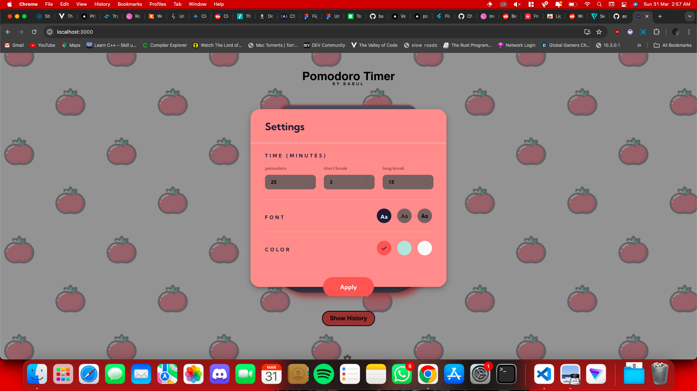
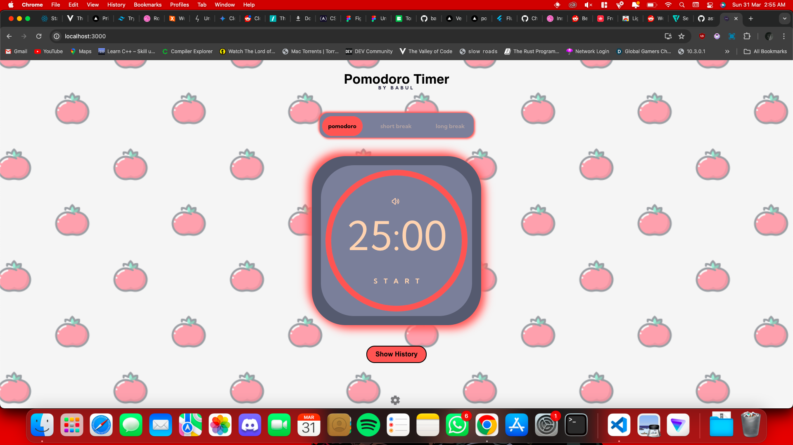

# Pomodoro Timer

This project is a Pomodoro Timer built with React. The Pomodoro Technique is a time management method that uses a timer to break work into intervals, traditionally 25 minutes in length, separated by short breaks. Here I've created two break modes. The breaks are of 15 mins and 3 mins.

## Screenshot

## Features

- Start, pause, and reset the timer
- Customize the length of work and break intervals
- Sound notifications when the timer ends
- Beautiful and intuitive user interface

## Installation

To install the project, follow these steps:

1. Clone the repository: `git clone https://github.com/babul09/pomodoro-timer.git`
2. Navigate into the project directory: `cd pomodoro-timer`
3. Install the dependencies: `npm install`
4. Start the project: `npm start`

## Usage

Once you've started the project, you can use the timer to manage your work sessions. Click the "Start" button to start the timer, and use the "Pause" and "Reset" buttons as needed. You can customize the length of the work and break intervals in the settings.

## NOTES

This project was made as a task for GDSC club recruitment with a lill' help from chatgpt. This can also be installed as a webapp, check your browser for compatibility.

